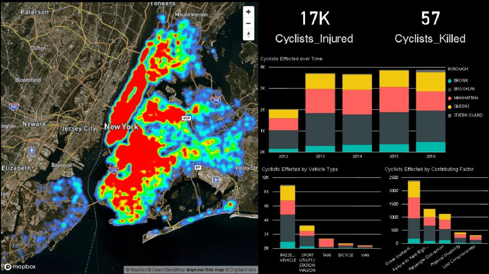

<h3 align="center">Data Science with Python - IBM</h3>

---

## 📝 Content

- [Python for Data Science](Python%20Basics)

- [Data Analysis with Python](Data%20Analysis)

- [Data Visualization with Python](Data%20Visualization)

## ⛏️ Built Using 

- Pandas
- Numpy
- Matplotlib
- Seaborn
- Jupyter Notebook
- Linear and Multiple Regression
- Exploratory Data Analysis
- Folium